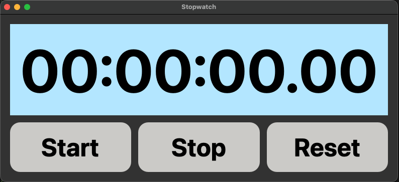

# PyQt5 Stopwatch

A simple desktop **Stopwatch** built with **PyQt5**. It shows hours, minutes, seconds, and hundredths, with **Start**, **Stop**, and **Reset** controls. Updates every 10 ms using a `QTimer`.

## Features
- ⏱️ Time format: `HH:MM:SS.hh` (hundredths)
- ▶️ **Start**, ⏸️ **Stop**, 🔁 **Reset**
- 🔄 Refresh interval: **10 ms** via `QTimer`
- 🎨 Clean styling via Qt stylesheets (rounded buttons, large digits)
- 🧩 Single-file script: `pyqt5_stopwatch.py`

## Requirements
- Python 3.8+
- PyQt5

Install locally:
```bash
python3 -m venv .venv
source .venv/bin/activate        # macOS/Linux
# .venv\Scripts\activate       # Windows PowerShell
pip install PyQt5
```

## Project structure
```
.
└── pyqt5_stopwatch.py
```

## Screenshots

* Screenshot of the output for the digital clock.

## Running
```bash
python pyqt5_stopwatch.py
```

## Controls
- **Start** – begins/resumes counting (ticks every 10 ms).
- **Stop** – pauses the stopwatch.
- **Reset** – stops and returns to `00:00:00.00`.

## How it works
- A `QTimer` with a 10 ms interval calls `update_display()`.
- The app keeps a `QTime(0, 0, 0, 0)` and advances it with `addMSecs(10)` on each tick.
- The label text is formatted with `f"{hours:02}:{minutes:02}:{seconds:02}.{milliseconds:02}"` to ensure leading zeros.
- Layout uses `QVBoxLayout` for the display and a `QHBoxLayout` for the buttons.
- Styling is applied using a single `setStyleSheet` block.

> ⚠️ **Note on precision**: GUI timers are not hard real‑time. On busy systems, ticks may be batched or delayed slightly. For higher-accuracy timing, consider `QElapsedTimer` or measuring real elapsed time between updates.

## Customize
- **Colors / Fonts**: tweak the CSS in `setStyleSheet(...)`.
- **Tick rate**: change `self.timer.start(10)` (e.g., `16` ≈ 60 FPS).
- **Initial size**: set a fixed size or add a bigger font for the label.

## Troubleshooting
- **PyQt5 not found** → activate your virtualenv and `pip install PyQt5`.
- **Window opens but no updates** → ensure `self.timer.start(10)` is called and `self.timer.timeout.connect(self.update_display)` is set.
- **Fonts look too small** → increase `font-size` in the label CSS block.
- **Buttons don’t respond** → verify the `.clicked.connect(...)` lines are present and not overridden later.

---

Happy timing!
